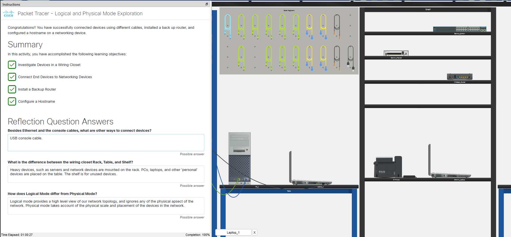

# cisco-packet-tracer-labs.
My completed laboratory works and practical activities from the Cisco CCNA course.
# Cisco Network Academy — Packet Tracer Labs

This repository contains my completed practical activities and laboratory works from the Cisco CCNA course.

## Module 1: Introduction to Networks

### Lab 1.1.6: Logical and Physical Mode Exploration

#### Objective
* Investigated network devices within a Wiring Closet (Seward Branch Office and Warrenton Data Center).
* Connected end-user devices (PCs and Laptops) to networking equipment using proper cabling.
* Deployed a `Backup_Router` from the inventory shelf to the production rack.
* Configured basic device identification via Cisco IOS Command Line Interface (CLI).

#### Technologies & Skills Used
* **Cisco Packet Tracer** (Logical & Physical topologies)
* **Cabling:** Copper Straight-Through (Ethernet), Console (RS232 to RJ45), USB-Console.
* **Cisco IOS CLI Commands:** `enable`, `configure terminal`, `hostname`.

#### Lab Verification & Results
All activity objectives were successfully met with a 100% completion score.

